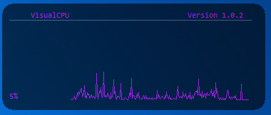
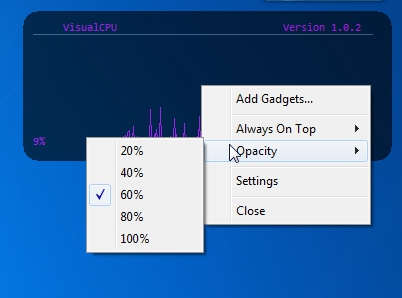
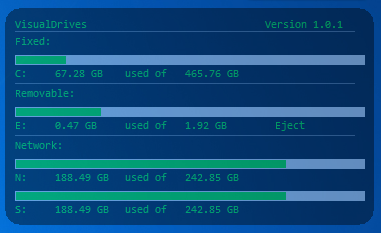
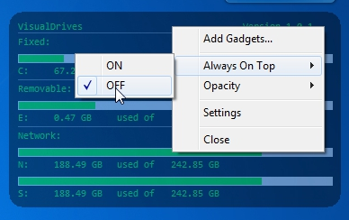

AHK_Gadgets
=======
 AutoHotkey scripts that mimic Windows 7 Gadgets 
They are movable, have opacity settings and will "remember" position 
These scripts are built using [AutoHotkey](http://ahkscript.org/)

[VisualCPU](VisualCPU.ahk) 
normal view 
 
after a right click event 
 
=> Has some limitations - sometimes graph times out or hangs to flatline 
=> Built with AutoHotkey 1.1.16.05 running on Windows 7 64bit 
=> Requires [Functions](Functions.ahk) and [XGraph](XGraph.ahk) to be in the same directory to compile 

[VisualDrives](VisualDrives.ahk) 
normal view 
 
after a right click event 
 
=> Has some limitations - Eject doesnt work for removable devices 
=> Based on code by jNizM 
=> Built with AutoHotkey 1.1.16.05 running on Windows 7 64bit 
=> Requires [Functions](Functions.ahk) to be in the same directory to compile
